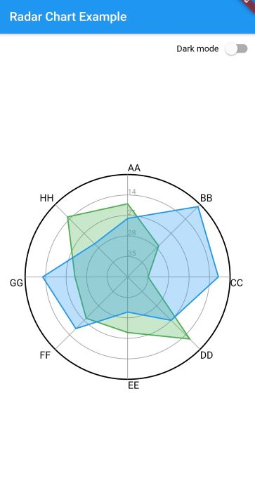
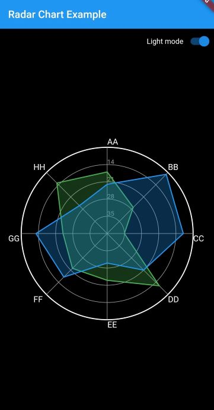
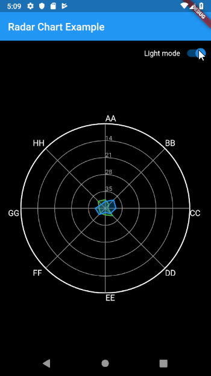

# flutter_radar_chart

Radar chart for Flutter inspired by The Python Graph Gallery (https://python-graph-gallery.com/radar-chart/).

Follow the instructions on pub to install this package.

## Example




# Usage

Basic usage of radar chart requires three pieces of data:

* `ticks` - Defines the numerical axis for the chart. Each tick generates an outline. Currently, each feature is plotted using the numerical range define by the ticks.
* `features` - Defines the numerical variables for each individual in the chart. There is no limit to the number of features.
* `data` - List of data points used to construct each individual in the chart. The number of data points must match the number of features. There is no limit to the number of individuals in the chart; however, multiple entities might cause the graph to become unreadable.

```dart
RadarChart.light(
    ticks: ticks,
    features: features,
    data: data,
),
```
A full example (as seen in the screenshots) can be found in example/lib/main.dart

# Animations!

WIP, but trying to add some life to the chart. Animation is currently triggered whenever the widget is updated (`didUpdateWidget`). Screenshot was captured with an emulator, so the animation is a bit janky.



# Future Work Ideas

There's a few more areas of work that I'd love to get around to building. I will eventually move these items over to issues for better tracking.

- [ ] Option for round corners
- [x] Animations on render
- [ ] Integration testing
- [ ] Responsive design
- [ ] Legends

# Acknowledgements

* The [Python Graph Gallery](https://python-graph-gallery.com) is a great resource.
* Kudos to [spider_chart](https://gitlab.com/cnsumner/flutter-spider-chart) for inspiring me to leverage Flutter's CustomPainter to build the radar chart.